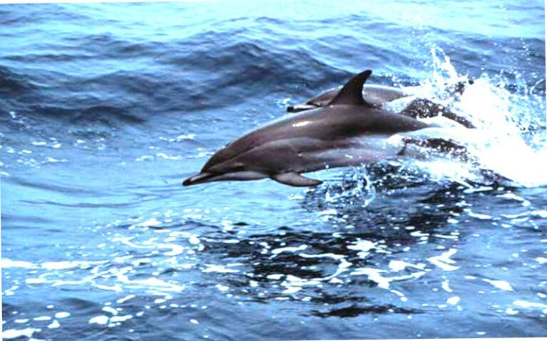
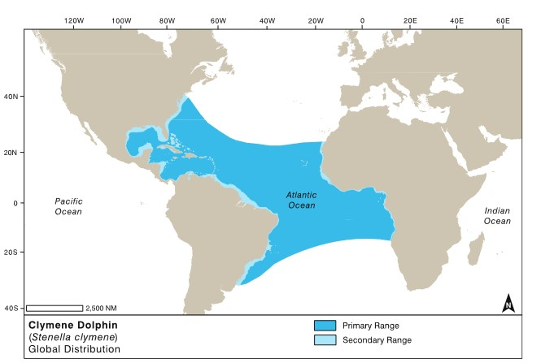

---
# Caribbean and Gulf of Mexico distribution model for key dolphin species.
## Luis David Almeida Famada. EAGLE - Applied Earth Observation and Geoanalysis, University of Würzburg
### 2023-04-15


# Introduction

This is a final project of the course: **Introduction to Programming and Geostatistics within the Master Program Applied Earth Observation and Geoanalysis** at the University of Würzburg with Professors Dr. Martin Wegmann and Dr. Jackob Schwalb-Willmann.

The project consists of several stages and has as a long-term goal the application of ecological niche modeling tools to determine the areas of highest species richness of the _Delphinidae_ family and their interaction with the main fishing grounds and marine protected areas of the Western North Atlantic, Gulf of Mexico and the Caribbean Sea.

In this first phase, we will start with an academic exercise using the _Stenella clymene_ or Clymene dolphin species to define the basis of the algorithm to be used for all species. Clymene dolphins are also known as "short-snouted spinners" because they often spin when they jump out of the water. Although there are no known major conservation problems for this species, it is likely that there are some undocumented problems. Some dolphins are killed in directed fisheries in the Caribbean, and others incidentally in nets throughout most of their range _(Jefferson, 2018)_

{withd=80%}

The Clymene dolphin is found only in the Atlantic Ocean, in tropical to warm-temperate waters. The exact range is not well documented, especially in South Atlantic, Mid-Atlantic and West African waters.  Most sightings have been in deep, offshore waters, although Clymene dolphins are sometimes observed very close to shore where deep water approaches the coast (such as around some Caribbean islands). They are present year-round at least in the northern Gulf of Mexico and probably throughout much of their tropical range.

{withd=90%}
# 1 Preparation of oceanographic variables and presence data.

After this stage, the code for the processing of the 13 most representative species of the family _Delphinidae_ in these regions will be presented. In these first stages we will work only with the **GBIF (Global Biodiversity Information Facility)** databases, then we will improve the presence databases by relying on information from Cuban institutions and other publications in the region _(Barragán-Barrera et al., 2019)_. 

The oceanographic variables used were selected from the MARSPEC _(Sbrocco et al., 2013)_ and Bio-Oracle _(Assis et al., 2018)_ datasets. These two data sets are the most widely used globally for species distribution modeling _(Melo-Merino et al., 2020)_. Please refer to the respective websites for a description of the variables and the methodology used:

**MARSPEC**: http://www.marspec.org/
**Bio-ORACLE**: https://www.bio-oracle.org/index.php

It is possible to access these layers in many ways using APIs from within the R environment. One of the most widely used is the **"sdmpredictors"** package from Samuel Bosch _(https://github.com/lifewatch/sdmpredictors)_. For the purposes of this work and to save time in the reproduction of the code, all the previous information was compiled by preprocessing each layer and preparing it for later use by the models. In this link _(https://mega.nz/folder/QNJAwBqA#rYw4nxo4wa8KJ3CEgbVy4Q)_ you can download the layers already trimmed and resampled for the study area. The resampling codes can be found in the project folder.

It was necessary to investigate the availability of presence data in the GBIF database. For this purpose, the "dismo" package of Hijmans and collaborators _(https://rspatial.org/raster/sdm)_ was mainly used.

Exploration of the availability of points of presence and species selection:
```{r message=FALSE, warning=FALSE}
# Load required packages
library(dismo)
library(ggplot2)

# Path to the enviromental variables
MARSPECT_path <- "D:/0_My_Analysis/Dolphin_distribution/Dolphin/MARSPECT_Resample"
BioOracle_path <- "D:/0_My_Analysis/Dolphin_distribution/Dolphin/BIO_Cliped"

# List all .tif and .tiff files in the folder
BioOracle_files <- list.files(path = BioOracle_path, pattern = "\\.(tif|tiff)$", full.names = TRUE, ignore.case = TRUE)

MARSPECT_files <- list.files(path = MARSPECT_path, pattern = "\\.(tif|tiff)$", full.names = TRUE, ignore.case = TRUE)

# Read the reference MARSPECT raster
reference_marspect_raster <- raster(MARSPECT_files[1])


# Read shapefile ROI
shp_ROI <- shapefile("D:/0_My_Analysis/Dolphin_distribution/Dolphin/Vector_Layers/Study_Area.shp")
shp_ROI_transformed <- spTransform(shp_ROI, proj4string(reference_marspect_raster))


# Define the species list with genus and species names
species_list <- list(
  list(genus = "Lagenorhynchus", species = "albirostris"),
  list(genus = "Feresa", species = "attenuata"),
  list(genus = "Peponocephala", species = "electra"),
  list(genus = "Globicephala", species = "macrorhynchus"),
  list(genus = "Globicephala", species = "melas"),
  list(genus = "Pseudorca", species = "crassidens"),
  list(genus = "Grampus", species = "griseus"),
  list(genus = "Orcinus", species = "orca"),
  list(genus = "Steno", species = "bredanensis"),
  list(genus = "Stenella", species = "attenuata"),
  list(genus = "Tursiops", species = "truncatus"),
  list(genus = "Stenella", species = "coeruleoalba"),
  list(genus = "Phocoena", species = "phocoena")
)

# Initialize an empty vector to store the record counts
record_counts <- c()

# Loop through the species list and download records for each species
for (species_info in species_list) {
  species_data <- gbif(
    genus = species_info$genus,
    species = species_info$species,
    ext = shp_ROI_transformed,
    download = FALSE,
    geo = TRUE,
    removeZeros = TRUE,
    sp = FALSE
  )
  record_counts <- c(record_counts, print(species_data))
}

# Combine species names and record counts
species_records <- data.frame(Species = sapply(species_list, function(x) paste(x$genus, x$species)), RecordCount = record_counts)

# Order the species by the number of records
species_records <- species_records[order(species_records$RecordCount, decreasing = TRUE), ]

# Create a bar plot
ggplot(species_records, aes(x = reorder(Species, -RecordCount), y = RecordCount, fill = Species)) +
  geom_bar(stat = "identity") +
  scale_fill_manual(values = sample(colors(), length(species_list))) +
  theme(axis.text.x = element_text(angle = 45, hjust = 1)) +
  labs(title = "Number of records available for each of the most representative dolphin species",
       x = "Species",
       y = "Number of records downloaded") +
  guides(fill = FALSE)

```

# 2 Prepare the environmental in R for the single specie analysis (_Stenella clymene_).

After downloading the pre-processed variables together with the study area, we begin to prepare the working environment of our project in R Studio. All the libraries are necessary, but there are three that are unique to this type of analysis: **dismo**, **usdm** and **rJava**. The **dismo** package provides functions to model species distribution using various algorithms, such as Maxent, Random Forest, and Boosted Regression Trees. It is essential for species distribution modeling because it enables the implementation and evaluation of different models.The **usdm** package (Uncertainty Analysis for Species Distribution Models) provides functions to quantify and analyze the uncertainty in species distribution models. It is crucial for species distribution modeling because it helps assess the reliability and accuracy of model predictions.The **rJava** package provides a low-level bridge between R and Java, allowing R to use Java libraries and functions. Although not directly related to species distribution modeling, it is essential when using certain functions or packages that depend on Java, such as the Maxent algorithm in the dismo package.

The line options(**java.parameters = "-Xmx12g"**) sets the maximum amount of memory that the Java Virtual Machine (JVM) can use within the R session. In this case, it is set to 12 gigabytes (12g).Keep in mind that the value you set for the maximum memory allocation should be based on the available memory on your system. Allocating too much memory to the JVM could cause your system to become unresponsive or crash. Be cautious when adjusting this value and ensure that your system has enough memory to accommodate your needs.

The next part of the script is to load and process environmental data from two sources, **MARSPECT** and **Bio-Oracle**, along with a region of interest (ROI) shapefile. It sets the paths to the relevant folders, lists all the .tif and .tiff files, reads and stacks the rasters, and combines them into a single raster stack called 'Variables'. The script also prints the names of the layers in the stack and reads the ROI shapefile, transforming its projection to match the reference MARSPECT raster. The output is a combined raster stack with environmental data and a transformed shapefile representing the study area.


```{r message=FALSE, warning=FALSE}

# List of required packages
required_packages <- c("raster", "sf", "sp", "dismo", "maptools", "usdm", "rJava", "mapview")

# Install and load packages
for (pkg in required_packages) {
  if (!requireNamespace(pkg, quietly = TRUE)) {
    install.packages(pkg)
  }
  library(pkg, character.only = TRUE)
}

# Load necessary libraries
library(raster)
library(sf)
library(sp)
library(dismo)
library(maptools)
library(usdm)
library(rJava)
library(mapview)

# Set Java memory limit
options(java.parameters = "-Xmx12g") 

# Set the working directory
setwd("D:/0_My_Analysis/Dolphin_distribution/Dolphin")

# Set paths to the environmental variables
MARSPECT_path <- "D:/0_My_Analysis/Dolphin_distribution/Dolphin/MARSPECT_Resample"
BioOracle_path <- "D:/0_My_Analysis/Dolphin_distribution/Dolphin/BIO_Cliped"

# List all .tif and .tiff files in the folders
BioOracle_files <- list.files(path = BioOracle_path, pattern = "\\.(tif|tiff)$", full.names = TRUE, ignore.case = TRUE)

MARSPECT_files <- list.files(path = MARSPECT_path, pattern = "\\.(tif|tiff)$", full.names = TRUE, ignore.case = TRUE)

# Read and stack rasters
reference_marspect_raster <- raster(MARSPECT_files[1])
bio_rasters <- stack(lapply(BioOracle_files, raster))
marspect_rasters <- stack(lapply(MARSPECT_files, raster))
Variables <- stack(bio_rasters, marspect_rasters)

# Print the image collection
names(Variables)

# Read and transform the ROI shapefile
shp_ROI <- shapefile("D:/0_My_Analysis/Dolphin_distribution/Dolphin/Vector_Layers/Study_Area.shp")
shp_ROI_transformed <- spTransform(shp_ROI, proj4string(reference_marspect_raster))

```

# 3 Prepare presence data.

This code block is focused on obtaining and preparing species presence data for the _Stenella clymene_ (Clymene dolphin) from the **Global Biodiversity Information Facility (GBIF)** database and preparing it for Maxent modeling. 

First, it downloads the species presence data using the **gbif()** function with parameters specifying the genus, species, and desired output format. The data is limited to a specific geographic extent defined by _shp_ROI_transformed_, and only records with georeferences are downloaded. The code then provides an overview of the data's dimensions and column names and visualizes the presence points on a world map.

Next, the data is cleaned by identifying empty records and converting it to a SpatialPointsDataFrame with a defined Coordinate Reference System (CRS). To eliminate sample bias, the **gridSample()** function is used, which samples the presence points based on a raster grid with a specified resolution. The presence data is then combined with a set of random background points, generated using the **randomPoints()** function, and converted to SpatialPointsDataFrame objects.

Finally, the data is divided into training and testing sets using the k-fold method with a random seed set to 0 to ensure reproducibility. The presence and background points are split separately into training and testing datasets, which will be used for modeling and evaluation in the Maxent modeling process.

```{r message=FALSE, warning=FALSE}
# Obtain species presence data from GBIF database
Stenella_clymene <- gbif(genus = "Stenella", #the genus name
                         species = "clymene", #the species name
                         ext = shp_ROI_transformed, #object to limit the geographic extent of the records
                         download=TRUE, #whether to download the records or just show the number
                         geo=TRUE, # whether to only download records that have a georeference
                         sp=FALSE) # whether to return a SpatialPointsDataFrame

# Explore the data
dim(Stenella_clymene)

# Visualize the presence points on a map
data(wrld_simpl)
plot(wrld_simpl, xlim=c(-100,-50), ylim=c(8,50),axes=TRUE, col="light yellow")
box() # restore the box around the map
points(Stenella_clymene$lon, Stenella_clymene$lat, col='red', cex=0.75) # add the points


# Data cleaning
# Seach empty records
lonzero = subset(Stenella_clymene, lon==0)
lonzero[, 1:13]

# Convert to SpatialPolygonsDataFrame and set CRS
coordinates(Stenella_clymene) <- ~lon+lat
crs(Stenella_clymene) <- crs(projection(reference_marspect_raster))


# Eliminate sample bias
e <- extent(Stenella_clymene)
r <- raster(e) # create a RasterLayer with the same extent
res(r) <- 0.25 # set the resolution of the cells to (for example) 1 degree
r <- extend(r, extent(r)+1)
Stenella_clymene_fix <- gridSample(Stenella_clymene, r, n=1) # sample


# Prepare data for Maxent
bg_points <- randomPoints(mask = Variables, #a Raster* object
                          n = 300, #Number of points
                          ext = extent(Stenella_clymene_fix),
                          p = Stenella_clymene_fix, #Presence points
                          excludep = TRUE) #If TRUE, presence points are excluded from background

# Convert to SpatialPointsDataFrame objects
bg_points <- SpatialPointsDataFrame(coords = bg_points, data = data.frame(id = 1:nrow(bg_points)), proj4string = CRS(proj4string(Variables)))
presence_points <- SpatialPointsDataFrame(coords = Stenella_clymene_fix, data = data.frame(id = 1:nrow(Stenella_clymene_fix)), proj4string = CRS(proj4string(Variables)))


# Split data into training and testing sets using k-fold
set.seed(0)

groupP <- kfold(presence_points, 5)
pres_train <- presence_points[groupP != 1, ]
pres_test <- presence_points[groupP == 1, ]

groupB <- kfold(bg_points, 5)
bg_train <- bg_points[groupB != 1, ]
bg_test <- bg_points[groupB == 1, ]
```

# 4 Choosing the best variables for the analysis.

Now we are need to exclude variables with high correlation from the environmental variables dataset to improve the performance of species distribution models.

First, the **extract()** function is used to obtain the values of environmental variables at the locations of the presence points in the training dataset. The method is set to "bilinear" for interpolation, the small parameter is set to FALSE, the summary function is set to mean, and missing values are removed with na.rm set to TRUE.

Next, the **vifstep()** function is applied to the extracted values of environmental variables. The **Variance Inflation Factor (VIF)** is a measure of multicollinearity among predictor variables, and **vifstep()** is a stepwise variable selection method based on VIF. It identifies and removes variables with high multicollinearity, as they can lead to unstable parameter estimates in the model.

Finally, the **exclude()** function is used to create a new dataset called Variables_Good that contains only the environmental variables with acceptable levels of multicollinearity. This dataset will be used for building the species distribution model without the influence of highly correlated variables.


```{r message=FALSE, warning=FALSE}
# Exclude variables with high correlation
pres_train_value <- extract(Variables, pres_train, 
                            method = "bilinear",  #can be set to 'simple' or 'bilinear'
                            small = FALSE, #If the function always returns a number, even when the buffer does not include the center of a single cell.
                            fun = mean, #specify a function to summarize the extracted values. max or mean
                            na.rm = TRUE) #whether to remove missing values from the data before applying the summary function (fun) to the extracted values. 

vifstep_var <- vifstep(pres_train_value)

Variables_Good <- exclude(Variables, vifstep_var)

names(Variables_Good)
```

# 5 Apply the Maxent model.

An last we run a **Maxent *model**, evaluating its performance, and visualizing the results using the refined environmental variables and presence points data. MaxEnt (short for “Maximum Entropy”; _Phillips et al., 2006_) is the most widely used SDM algorithm. _Elith et al. (2010)_ provide an explanation of the algorithm (and software) geared towards ecologists. MaxEnt is available as a stand-alone Java program. Dismo has a function ‘maxent’ that communicates with this program.

In this part we start with a custom function to extract environmental variables values within a buffer around each presence point. It returns the mean and standard deviation of the values within the buffer.Then the main Maxent model is created using the **maxent()** function with the refined environmental variables and training presence and background points. The custom my_extractor function is passed as an argument for extracting variables.The Model results visualization through  plot(maxent_model) function creates a variable contribution plot, while response(maxent_model) generates a response plot.The **evaluate()** function assesses the model performance using the testing presence and background points. The results are stored in evaluate_Max.

Next, The **predict()** function generates a prediction map for species distribution using the trained Maxent model and refined environmental variables.A threshold is calculated using the 'spec_sens' method, and a presence/absence map is created by comparing the prediction values to this threshold.And last to Visualize the presence/absence map, **mapview()** function is used again to display the binary presence/absence map of the species distribution.

The key factors influencing the presence of the Stenella clymene species are as follows:

1. Nitrate concentration (average value)
2. Surface salinity (maximum value per month)
3. Bathymetry (depth in meters)
4. Dissolved oxygen (average value)
5. Distance to the coast (in kilometers)
6. Primary productivity (average value)

The predictive model for this species has an Area Under the Curve (AUC) value of 0.9265152, indicating a high degree of accuracy in its predictions. However, it is important to continuously calibrate the model because each iteration may slightly alter its accuracy and the projected area of the species' presence. This variability primarily stems from the model's reliance on pseudo-absences, which are generated randomly in our analysis.

Based on the variables identified, we can propose the following hypotheses about the factors influencing the presence of this dolphin species:

- Nitrate concentration (average value): Nitrate levels might influence the presence of phytoplankton, which serves as the base of the marine food chain. Higher nitrate concentrations could support larger populations of prey species for the Clymene dolphin, making these areas more attractive for foraging.

- Surface salinity (maximum value per month): The monthly maximum surface salinity could be a proxy for the dolphin's preferred habitat conditions. It might indicate areas with lower freshwater input from rivers, which may provide more stable environments for the species.

- Bathymetry (depth in meters): The depth of the water might be an important factor because it can determine the types of prey available and influence the dolphin's foraging behavior. Clymene dolphins are known to inhabit both shallow and deep waters, but their distribution might be influenced by the depth-dependent availability of prey species.

- Dissolved oxygen (average value): Dissolved oxygen is crucial for the survival of marine organisms, including the prey species of the Clymene dolphin. Areas with higher dissolved oxygen concentrations might support more abundant and diverse prey populations, making them more attractive to the dolphins.

- Distance to the coast (in kilometers): Proximity to the coast might affect the presence of the Clymene dolphin by influencing the abundance and distribution of prey species. Coastal areas can have high levels of primary productivity, which in turn supports a diverse and abundant prey base for the dolphins.

- Primary productivity (average value): Primary productivity is a measure of the rate at which plants and algae produce organic matter through photosynthesis. Higher primary productivity levels can lead to greater availability of food resources for the marine food chain, including the prey species consumed by Clymene dolphins. As a result, the dolphins might be more likely to inhabit areas with higher primary productivity.

These hypotheses can help guide further research into the ecological factors influencing the distribution and habitat preferences of the Clymene dolphin. However, it is important to note that these hypotheses are based on correlations and should be tested with more in-depth studies to establish causal relationships.

```{r message=FALSE, warning=FALSE}
# Function to extract variables in a larger area
my_extractor <- function(raster_layer, points) {
  extract(raster_layer, buffer(points, width=3)) %>%
    apply(2, function(x) c(mean(x), sd(x)))
  }

#Run Maxent model

maxent_model <- maxent(x=Variables_Good,
                       p=pres_train,
                       a=bg_train,
                       factors=NULL, 
                       removeDuplicates=TRUE,
                       extract=my_extractor,
                       args=c("-P", "autorun", "nowarnings"),
                       path="D:/0_My_Analysis/Dolphin_distribution/Dolphin/Maxent_model")

# Plot Maxent model results
plot(maxent_model) # Variable Contribution


# Evaluate the model with test points
evaluate_Max <- evaluate(pres_test, bg_test, maxent_model, Variables_Good)
evaluate_Max

# Make predictions using the model
Stenella_clymene_Prediction <- predict(maxent_model, Variables_Good,  ext=extent(reference_marspect_raster))


# Visualize Maxent raw values
mapview(Stenella_clymene_Prediction, zcol = "value",
                                     map.types = "OpenStreetMap",
                                     legend = TRUE,
                                     alpha = 0.5,
                                     col.regions = viridis::viridis,
                                     main = "Maxent, raw values")

# Apply the threshold and create a presence/absence map
tr <- threshold(evaluate_Max, 'spec_sens')
presence_absence <- Stenella_clymene_Prediction > tr
mapview(presence_absence, zcol = "value",
                          map.types = "OpenStreetMap", 
                          legend = TRUE,
                          alpha = 0.3,
                          col.regions = c("white", "red"),
                          main = "presence/absence")

# Generate 'response plots'
.jinit() # initializes the Java Virtual Machine in R
response(maxent_model) # A response plot
```
# 6 Analysis of the result with Protected Areas and Exclusive Economic Zone

The last part of the analysis we reads in two shapefiles representing Exclusive Economic Zone and International Hydrographic Organization (EEZ-IHO) areas and Protected Areas (WDPA) and transforms them to match the projection of a raster file called "presence_absence". It then extracts the presence-absence values for each polygon in both shapefiles, calculates the count of presence pixels within each polygon, and adds the presence count as a new column to each shapefile. The code then calculates the sum of Presence_Count for each unique value in the EEZ and ISO3 columns of the EEZ-IHO and WDPA shapefiles, respectively, and prints the results in descending order. This code is likely being used to analyze the distribution of dolphins in relation to protected areas and EEZ-IHO areas.

In a preliminary analysis of the governance of the potential habitat of the species, we realise that the United States, Mexico and Cuba have a predominant influence on the conservation of the species. In addition, the low coverage of the current system of protected areas in this region is evident, without discriminating against areas that are not approved or do not have a management plan. 

This preliminary work has a high potential for further analysis of the status of marine dolphin species.

```{r}
# Compare result with Exclusive Economic Zone and International Hydrographic Organization (EEZ - IHO) areas 
shp_EEZIHO <- shapefile("D:/0_My_Analysis/Dolphin_distribution/Dolphin/Vector_Layers/EEZ_IHOv42020.shp")
shp_EEZIHO_transformed <- spTransform(shp_EEZIHO, proj4string(reference_marspect_raster))

# Extract presence-absence values for each polygon
EEZIHO_ext <- extract(presence_absence, shp_EEZIHO_transformed)

# Calculate the count of presence pixels within each polygon
EEZIHO_counts <- sapply(EEZIHO_ext, function(x) sum(x == 1, na.rm = TRUE))

# Add the presence count as a new column to the shapefile
shp_EEZIHO_transformed@data$EEZIHO_counts <- EEZIHO_counts

# Calculate the sum of Presence_Count for each unique value in the IHO_SEA column
EEZIHO_sum <- aggregate(EEZIHO_counts ~ EEZ, data = shp_EEZIHO_transformed, FUN = sum)
EEZIHO_sum <- subset(EEZIHO_sum, EEZIHO_counts > 0)
EEZIHO_sum <- EEZIHO_sum[order(EEZIHO_sum$EEZIHO_counts, decreasing = TRUE), ]
print(EEZIHO_sum)


# Compare result with Protect Area (WDPA) areas
shp_WDPA <- shapefile("D:/0_My_Analysis/Dolphin_distribution/Dolphin/Vector_Layers/WDPA_Apr2023.shp")
shp_WDPA_transformed <- spTransform(shp_WDPA, proj4string(reference_marspect_raster))

# Extract presence-absence values for each polygon
WDPA_values <- extract(presence_absence, shp_WDPA_transformed)

# Calculate the count of presence pixels within each polygon
WDPA_counts <- sapply(WDPA_values, function(x) sum(x == 1, na.rm = TRUE))

# Add the presence count as a new column to the shapefile
shp_WDPA_transformed@data$WDPA_counts <- WDPA_counts


# Calculate the sum of Presence_Count for each unique value in the IHO_SEA column
WDPA_sum <- aggregate(WDPA_counts ~ ISO3, data = shp_WDPA_transformed, FUN = sum)
WDPA_sum <- subset(WDPA_sum, WDPA_counts > 0)
WDPA_sum <- WDPA_sum[order(WDPA_sum$WDPA_counts, decreasing = TRUE), ]
print(WDPA_sum)
```


# Bibliography

Barragán-Barrera, D. C., do Amaral, K. B., Chávez-Carreño, P. A., Farías-Curtidor, N., Lancheros-Neva, R., Botero-Acosta, N., Bueno, P., Moreno, I. B., Bolaños-Jiménez, J., Bouveret, L., Castelblanco-Martínez, D. N., Luksenburg, J. A., Mellinger, J., Mesa-Gutiérrez, R., de Montgolfier, B., Ramos, E. A., Ridoux, V., & Palacios, D. M. (2019). Ecological Niche Modeling of Three Species of Stenella Dolphins in the Caribbean Basin, With Application to the Seaflower Biosphere Reserve. Frontiers in Marine Science, 6, 10. https://doi.org/10.3389/fmars.2019.00010

Carmezim, J., Pennino, M. G., Martínez-Minaya, J., Conesa, D., & Coll, M. (2022). A mesoscale analysis of relations between fish species richness and environmental and anthropogenic pressures in the Mediterranean Sea. Marine Environmental Research, 180, 105702. https://doi.org/10.1016/j.marenvres.2022.105702

Jefferson, T. A. (2018). Clymene Dolphin. In Encyclopedia of Marine Mammals (pp. 197–200). Elsevier. https://doi.org/10.1016/B978-0-12-804327-1.00093-5

Jefferson, T.A., Webber, M.A., and Pitman, R.L. (2015). “Marine Mammals of the World: A Comprehensive Guide to Their Identification,” 2nd ed. Elsevier, San Diego, CA.

Melo-Merino, S. M., Reyes-Bonilla, H., & Lira-Noriega, A. (2020). Ecological niche models and species distribution models in marine environments: A literature review and spatial analysis of evidence. Ecological Modelling, 415, 108837. https://doi.org/10.1016/j.ecolmodel.2019.108837

Sbrocco, E. J., & Barber, P. H. (2013). MARSPEC: Ocean climate layers for marine spatial ecology: Ecological Archives E094-086. Ecology, 94(4), 979–979. https://doi.org/10.1890/12-1358.1

Assis J, Tyberghein L, Bosch S, Verbruggen H, Serr~ao EA, De Clerck O (2018). Bio-ORACLE v2.0: Extending marine data layers for bioclimatic modelling. Global Ecol Biogeogr. ;27:277–284. https://doi.org/10.1111/geb.12693

Perrin, W. F., Würsig, B., & Thewissen, J. G. M. (Eds.). (2018). Encyclopedia of Marine Mammals (3rd ed.). Academic Press.
